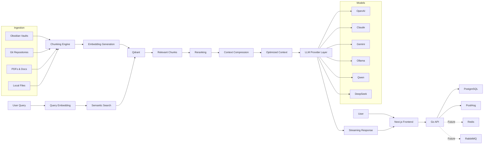

Technology choices and system architecture for NeuralVault.

---

## System Flow



---

## Technology Stack

| Layer      | Technology           |
| ---------- | -------------------- |
| Frontend   | Next.js              |
| Backend    | Go + Chi             |
| Vector DB  | Qdrant               |
| Database   | PostgreSQL           |
| Local AI   | Ollama               |
| Embeddings | nomic-embed-text     |
| Streaming  | HTTP Streaming / SSE |
| Analytics  | PostHog              |
| Cache      | Redis (future)       |
| Queue      | RabbitMQ (future)    |

---

## Pluggable Providers

Both the embedding model used for indexing and the AI providers used for inference are **pluggable** — there is no hardcoded provider in the codebase.

The system exposes a provider abstraction layer that allows:

- Swapping embedding models without changing the ingestion pipeline
- Adding or removing LLM providers without touching the retrieval logic
- Configuring providers per workspace or per user

This means NeuralVault is model-agnostic by design. The default configuration uses `nomic-embed-text` via Ollama for local embeddings, but any compatible provider can be wired in.

---

## High-level Architecture

```text
User
↓
Frontend Chat
↓
Go API
↓
Retrieval Engine
↓
Qdrant Vector Search
↓
Context Optimization
↓
LLM Provider
↓
Streaming Response
```

---

## Infrastructure

NeuralVault runs entirely via Docker Compose — the same `docker-compose.yml` is used in local dev, staging, and production, regardless of the underlying host (bare metal, VM, hypervisor, or cloud instance). There is no separate hosting layer for non-production environments; only the environment variables differ.

Services deployed:

- Ollama
- Qdrant
- PostgreSQL
- MinIO
- Go API
- Next.js

---

## Architecture Decisions

- [ADR-001 — Why Go for the core](adr/ADR-001-core-language-decision.md)
- [ADR-002 — Why PostgreSQL](adr/ADR-002-core-database-decision.md)
- [ADR-003 — Why Qdrant](adr/ADR-003-core-vector-database-decision.md)

---

## Technical Specs

Per-component technical specs (implemented and planned) live in [docs/specs/](specs/), one `SPEC-NNN` file per system area.
